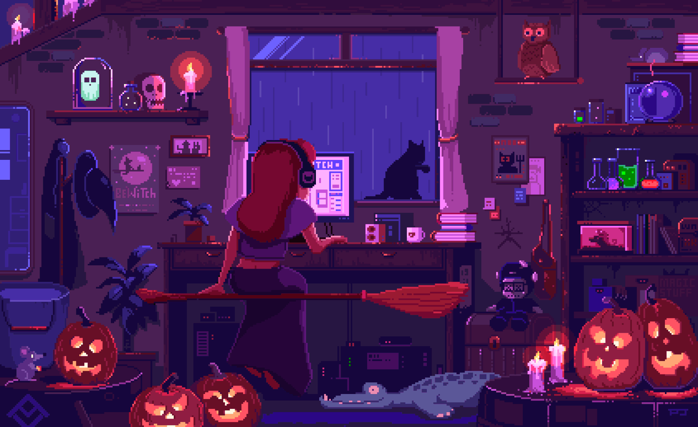

<h1 align="center"> 🦊 Heya ! My name is Leane - aka Sellith</h1>

  <strong><em><code>Code, Review, Learn, Repeat</code></em></strong>
   
  <h2>I'm a computer science student at 42. Welcome to my profile page!</h2>
    

      <ul>
        <li>🔭 I’m currently working on 42 project, trying to finish my common core. 💪🏼</li>
        <li>🌱 I’m currently learning... a lot of thing ! THE GROW NEVER ENDS ! 😂</li>
        <li>⚡ Fun fact: I love to play guitar and to build them ! 🦊</li>
      </ul>
    

  

<h2><strong>Connect with me !</strong></h5>

<h2><strong>Langages and tools !</strong></h5>

  
  
  
  
  
  
  
  
  

<!-- 
- 👯 I’m looking to collaborate on ...
- 🤔 I’m looking for help with ...
- 💬 Ask me about ...
- 📫 How to reach me: ...
- 😄 Pronouns: ...
- ⚡ Fun fact: ...
 -->
